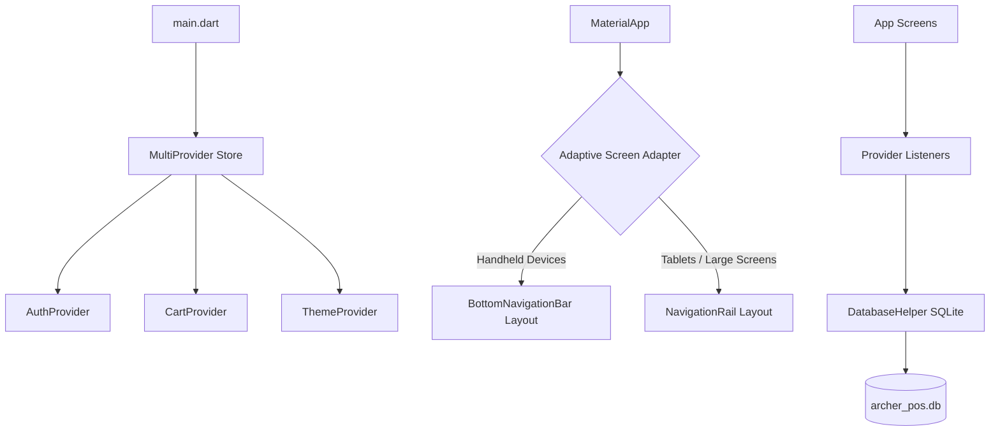
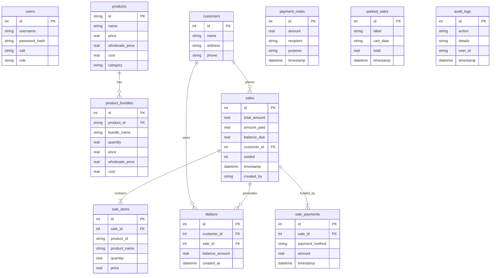

<div align="center">
  
  <h1>🎯 Archer POS v2</h1>
  <p><strong>A Sleek, Adaptive, Offline-First Point of Sale (POS) System for Android</strong></p>

  [](https://flutter.dev)
  [](https://dart.dev)
  [](https://www.sqlite.org)
  [](https://android.com)
  [](https://pub.dev/packages/provider)
</div>

---

## 📖 Introduction

**Archer POS v2** is a professional-grade, mobile-first Point of Sale application engineered in Flutter and Dart. Designed to migrate the core business logic of the original Python/PySide6 desktop suite, Archer POS v2 features a fully adaptive interface that scales dynamically across Android smartphones and tablets. Equipped with an offline-first SQLite database (`sqflite`), Provider state management, and real-time barcode scanning, it offers retail businesses a reliable, highly performant tool for everyday transactions, inventory management, and debt tracking.

---

## 🏗️ System Architecture

Archer POS v2 utilizes a clean architecture model separating the data layers, application state, and dynamic user interface layout.



### 📱 Adaptive UI Design
The interface adapts dynamically based on screen real estate:
* **Smartphones (Portrait/Landscape)**: Uses a standard bottom navigation bar to maximize input areas.
* **Tablets (Landscape-first)**: Transitions into a structural navigation rail, providing instant access to modules and split-screen layouts.

---

## 📊 Database Schema (SQLite)

The backend runs on an embedded SQLite database (`archer_pos.db`) loaded directly from assets or initialized dynamically. The schema architecture is diagrammed below:



---

## ✨ Features Breakdown

* 📊 **Dashboard**: Real-time sales stats, daily transaction counts, total active catalog size, and overall customer outstanding debt balances computed using SQLite aggregations.
* 🛒 **Point of Sale (POS)**: Supported by `mobile_scanner` for instant camera-based barcode lookups. Features multi-pricing (retail, wholesale, bundle price rules), cart items sorting (latest scanned item moved to top), and parked carts.
* 📦 **Product Manager**: Full CRUD capability for products, category categorization, and bundles creation.
* 💳 **Balance & Debt Tracker**: Tracks outstanding credit per customer. Payments dynamically settle the oldest debts first using a FIFO queue transaction model.
* 📝 **Payment Notes**: Logs external business payouts/expenses with persistent recipient search tags.
* 🔍 **Audit Trail (Data Logs)**: Chronological user action logging, receipt reprints, and sale voiding capabilities.

---

## 🔐 Access Control Matrix

Archer POS v2 features granular user privileges to protect business transactions. Any restricted actions performed by **Staff** require an Admin password validation popup to proceed.

| System Action | Admin | Staff | Security Bypass Override |
| :--- | :---: | :---: | :---: |
| View Main Dashboard & Logs | ✅ | ✅ | None |
| Perform Sales Transactions | ✅ | ✅ | None |
| Delete Item from Active Cart | ✅ | ⚠️ | **Requires Admin Password** |
| Apply Custom Cart Discounts | ✅ | ⚠️ | **Requires Admin Password** |
| Void Active Cart / Clear POS | ✅ | ⚠️ | **Requires Admin Password** |
| Create, Edit, or Delete Products | ✅ | ❌ | **Restricted to Admin** |
| Manage Product Bundles & Costs | ✅ | ❌ | **Restricted to Admin** |
| Void Sale / Reprint Historical Receipts | ✅ | ⚠️ | **Requires Admin Password** |
| Delete Payment Notes & Expenses | ✅ | ⚠️ | **Requires Admin Password** |

### Default Credentials
> 🔑 **Username**: `admin`
> 🔑 **Password**: `admin`
> 
> *⚠️ Note: Developers and operators are advised to change this default password upon initial deployment via Account Settings.*

---

## 📂 Project Directory Map

Below is an overview of the core modular directory structure of the Flutter source code:

```
lib/
├── main.dart                          # App initialization, Providers configuration & theme loader
├── core/
│   ├── database/
│   │   └── database_helper.dart       # SQLite transactions, DB initialization, and FIFO debt settlement
│   ├── models/
│   │   ├── product.dart               # Product catalog representation
│   │   ├── sale.dart                  # Sale structures and receipt payloads
│   │   ├── customer.dart              # Customer profiles and contact objects
│   │   └── bundle.dart                # Bundle quantity-pricing maps
│   ├── providers/
│   │   ├── auth_provider.dart         # Authentication state, session handling
│   │   ├── cart_provider.dart         # Cart state, item sorting, pricing calculations
│   │   └── theme_provider.dart        # Light and Dark theme configurations
│   └── utils/
│       ├── constants.dart             # Application-wide styles, colors, and layout configurations
│       └── formatters.dart            # Currency & timezone format utilities
└── screens/
    ├── login/
    │   └── login_screen.dart          # Secure login form with SHA-256 validation
    ├── main/
    │   └── main_screen.dart           # Adaptive Navigation layout (Bottom Bar vs Navigation Rail)
    ├── dashboard/
    │   └── dashboard_screen.dart      # Business statistics dashboard
    ├── pos/
    │   ├── pos_screen.dart            # Standard transaction layout
    │   └── widgets/
    │       ├── cart_item_tile.dart    # Cart item list item with swipe-to-delete
    │       ├── checkout_dialog.dart   # Payment, change, and debt creation panel
    │       ├── quick_add_dialog.dart  # Rapid product entry dialog
    │       └── park_recall_dialog.dart# Active cart parking & recovery
    ├── inventory/
    │   ├── inventory_screen.dart      # Product catalog list
    │   └── widgets/
    │       ├── product_form_dialog.dart# CRUD add/edit dialog
    │       └── bundle_dialog.dart     # Bundle configuration panel
    ├── balance/
    │   └── balance_screen.dart        # Debt list & balance settlement portal
    ├── logs/
    │   └── logs_screen.dart           # Audit trails & transaction history logs
    ├── account/
    │   └── account_screen.dart        # Security & user management settings
    └── payment_notes/
        └── payment_notes_screen.dart  # Outflow logs & payout records
```

---

## ⚡ Technical Specifications & Protocols

* **Cryptographic Security**: Passwords are saved as `SHA-256` hashes salted using dynamic `MD5` strings generated at runtime.
* **Timezone Consistency**: All transaction and log timestamps are forced to **UTC+8** (Philippines Standard Time) inside the database helper to avoid inconsistencies across devices.
* **Data Retention Policy**: Audit logs contain automated cleanups enforcing a **90-day** maximum retention window.
* **Receipt Exporter**: Generates 58mm thermal-compatible PDF files via `pdf` and initiates device printer dialogs using the `printing` utility.
* **Database Import**: Supports importing products and pricing structures from external SQLite `.db` collections using SQL transaction block scripts.

---

## 🚀 Getting Started (Developer Setup)

### Prerequisites
* **Flutter SDK**: `^3.0.0`
* **Dart SDK**: `^2.17.0`
* **Android Studio** or **VS Code** with Flutter extensions installed
* An active Android Emulator or physical device (API Level 21+)

### Installation

1. **Clone and Navigate**:
   ```bash
   git clone <repository-url>
   cd Archer-POS-Mobile
   ```

2. **Install Flutter Packages**:
   ```bash
   flutter pub get
   ```

3. **Verify Code Guidelines & Linter**:
   ```bash
   flutter analyze
   ```

4. **Run Unit Tests**:
   ```bash
   flutter test
   ```

5. **Start Dev Server / Compile to Android Device**:
   ```bash
   flutter run
   ```

### Production Build

* Build a standard release APK:
  ```bash
  flutter build apk --release
  ```

---

## 🧪 Testing Coverage

The application includes unit tests verifying crucial behaviors, such as the cart sorting order logic:
```bash
# Run specific provider tests
flutter test test/cart_provider_test.dart
```

* `test/cart_provider_test.dart` checks:
  * Newly added items are prepended to index 0 of the cart.
  * Duplicate scans update quantities and move the item back to the top of the queue.

---

*Developed by the Archer POS Engineering Team. For issues or custom setups, reach out via the developer repository portal.*