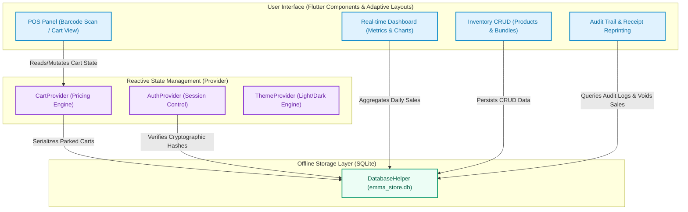
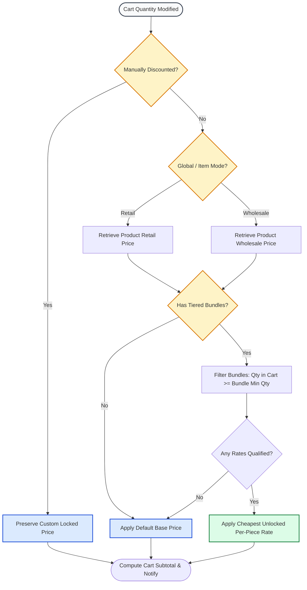

# 📱 EmmaSarmingStore v2 — Archer POS Mobile

[](https://flutter.dev)
[](https://dart.dev)
[](https://sqlite.org)
[](https://pub.dev/packages/provider)
[](https://android.com)

A high-performance, responsive Point of Sale (POS) system engineered with Flutter for Android devices (phones and tablets). This system replaces the legacy Python/PySide6 desktop client with a modern, database-driven mobile application featuring an offline-first architecture, flexible pricing matrices, barcode scanning, and multi-user role management.

---

## 🏗️ Architecture & Data Flow

`EmmaSarmingStore v2` uses a reactive state-driven architecture powered by **Provider** and local SQL storage via **SQLite (`sqflite`)**. The codebase is strictly partitioned to separate business logic, schema control, and widget trees.

### High-Level System Architecture



---

## 🏷️ The Cart Pricing & Bundle Engine

One of the project's core technical assets is its **Dynamic Pricing Engine** implemented inside `CartProvider`. It dynamically shifts individual items or the entire cart between *Retail* and *Wholesale* modes while resolving tiered *Bundle Prices* and maintaining *Manual Overrides (Discounts)*.



---

## 💾 Relational Database Schema

The SQLite schema is normalized, with constraints and foreign keys cascading to maintain database consistency. The tables are configured inside `database_helper.dart` under version `4`.

```
                  ┌─────────────────┐             ┌─────────────────┐
                  │    customers    │             │      users      │
                  └────────│────────┘             └─────────────────┘
                           │ 1                             
                           │                               
                           │ 0..*                          
┌───────────────┐ 0..*   ┌─▼───────────────┐ 1     ┌─────────────────┐
│    debtors    ├────────►      sales      ├───────►  sale_payments  │
└───────────────┘        └─▲───────────────┘ 0..*  └─────────────────┘
                           │ 1                             
                           │                               
                           │ 0..*                          
                         ┌─┴───────────────┐               
                         │   sale_items    │               
                         └────────▲────────┘               
                                  │ 0..*                   
                                  │                        
┌─────────────────┐ 1             │ 1                      
│    products     ├───────────────┴────────────────┐
└────────┬────────┘                                │
         │ 1                                       │
         │                                         │
         │ 0..*                                    │
┌────────▼────────┐                                │
│ product_bundles ├────────────────────────────────┘
└─────────────────┘
```

### Table Definitions

| Table Name | Primary Key | Key Columns / Constraints | Purpose |
| :--- | :--- | :--- | :--- |
| `users` | `id` (INTEGER Auto) | `username` (UNIQUE), `role` (admin/staff), `password_hash`, `salt` | Authentication and access control |
| `products` | `id` (TEXT) | `name`, `price`, `wholesale_price`, `cost`, `category` | Product registry and catalog |
| `product_bundles` | `id` (INTEGER Auto) | `product_id` (FK products CASCADE), `quantity`, `price`, `cost` | Tiered pricing rules for volume items |
| `customers` | `id` (INTEGER Auto) | `name`, `phone`, `address` | Customer profile tracking |
| `sales` | `id` (INTEGER Auto) | `total_amount`, `amount_paid`, `balance_due`, `customer_id` (FK), `voided` | Header transaction records |
| `sale_items` | `id` (INTEGER Auto) | `sale_id` (FK sales), `product_id`, `product_name`, `quantity`, `price` | Line-item transaction details |
| `debtors` | `id` (INTEGER Auto) | `customer_id` (FK), `sale_id` (FK), `balance_amount` | Tracks accounts receivable |
| `audit_logs` | `id` (INTEGER Auto) | `action`, `details`, `user_id`, `timestamp` | Comprehensive security logs (90-day retention) |
| `payment_notes` | `id` (INTEGER Auto) | `amount`, `recipient`, `purpose`, `timestamp` | Simple cash payouts and expense tracker |
| `parked_sales` | `id` (INTEGER Auto) | `label`, `cart_data` (JSON text blob), `total`, `timestamp` | Recallable drafts (parked carts) |
| `sale_payments` | `id` (INTEGER Auto) | `sale_id` (FK), `payment_method`, `amount`, `timestamp` | Split or individual payment methods |

---

## 👥 Security & Role Access Matrix

The system enforces strict permission parameters between `admin` and `staff` roles. If a `staff` member attempts to perform a sensitive operation, a secure administrative credential intercept dialog is displayed.

| Operation | Admin Role | Staff Role | Security Override Requirement |
| :--- | :---: | :---: | :--- |
| **Complete Sale Checkout** | ✅ | ✅ | None |
| **Apply Cart Discount** | ✅ | 🔒 | Admin password verification |
| **Delete Item from Cart** | ✅ | 🔒 | Admin password verification |
| **Void Active Cart** | ✅ | 🔒 | Admin password verification |
| **Add / Edit / Delete Products** | ✅ | ❌ | Prohibited |
| **Manage Product Bundles** | ✅ | ❌ | Prohibited |
| **Void Sale from History Logs** | ✅ | 🔒 | Admin password verification |
| **Delete Payment / Expense Notes** | ✅ | 🔒 | Admin password verification |
| **Enforce Data Retention Cleanup** | ✅ | ❌ | Prohibited |

---

## 📂 Codebase Directory Layout

```yaml
lib/
  ├── main.dart                 # App Initialization, MultiProvider configuration
  ├── core/                     # Internal Engine
  │   ├── database/
  │   │   └── database_helper.dart  # SQLite operations, password hashing (SHA-256)
  │   ├── models/               # Relational data wrappers (Product, Sale, Customer, Bundle)
  │   ├── providers/            # Providers handling authentication, cart engine, and theme
  │   └── utils/
  │       ├── constants.dart    # Styling Constants, Color Palette (WCAG Compliant), Breaks
  │       └── formatters.dart   # Date & Currency formatting rules
  └── screens/                  # Layout and Presentation Views
      ├── login/                # Access security view
      ├── main/                 # Main Responsive Shell (BottomNavigationBar vs NavigationRail)
      ├── dashboard/            # Graphical analytical charts and stats
      ├── pos/                  # Interactive shopping cart panel, scans, overlays
      ├── inventory/            # Product catalogs, bundles creation
      ├── balance/              # Accounts receivable and debtor resolution panel
      ├── logs/                 # Transaction logs, reprinting, void tools
      ├── account/              # Password resets, session overview
      └── payment_notes/        # Cash disbursement ledger
```

---

## 🚀 Getting Started & Setup

### Prerequisites
* **Flutter SDK**: `>=3.0.0 <4.0.0`
* **Android target**: SDK API level 21+ (Android 5.0 Lollipop or newer)
* **IDE**: VS Code (with Flutter extension) or Android Studio
* **Physical Device / Emulator**: Setup with Developer Mode and USB Debugging active

### Setup Checklist

1. **Clone the Repository**
   ```bash
   git clone https://github.com/your-repo/Emma-Pos-Mobile.git
   cd Emma-Pos-Mobile
   ```

2. **Retrieve Dependencies**
   ```bash
   flutter pub get
   ```

3. **Verify Dev Environment**
   ```bash
   flutter doctor
   ```

4. **Launch Application**
   ```bash
   flutter run
   ```

5. **Generate Release APK**
   ```bash
   flutter build apk --release
   ```

---

## 🛡️ Default Access Configuration

To bootstrap the local database, the system inserts a default admin profile on first run:

> [!IMPORTANT]
> * **Username**: `admin`
> * **Password**: `admin`
> * **Master Recovery Code**: `10152003`

> [!WARNING]
> Ensure the default password is changed immediately upon first login in production environments via **Account Settings**.

---

## 🔧 Automation Scripts

The project includes setup scripts to accelerate onboarding across operating systems:

* **Windows Setup (`setup_flutter.ps1` / `setup_project.bat`)**:
  Downloads, extracts, configurations environment paths, and validates the Flutter installation automatically.
* **Linux Environment (`setup_linux.sh`)**:
  Installs system development headers, establishes a virtual environment, and handles native tools.
* **Dev Run (`run.sh`)**:
  A shortcut execution wrapper script for testing locally.